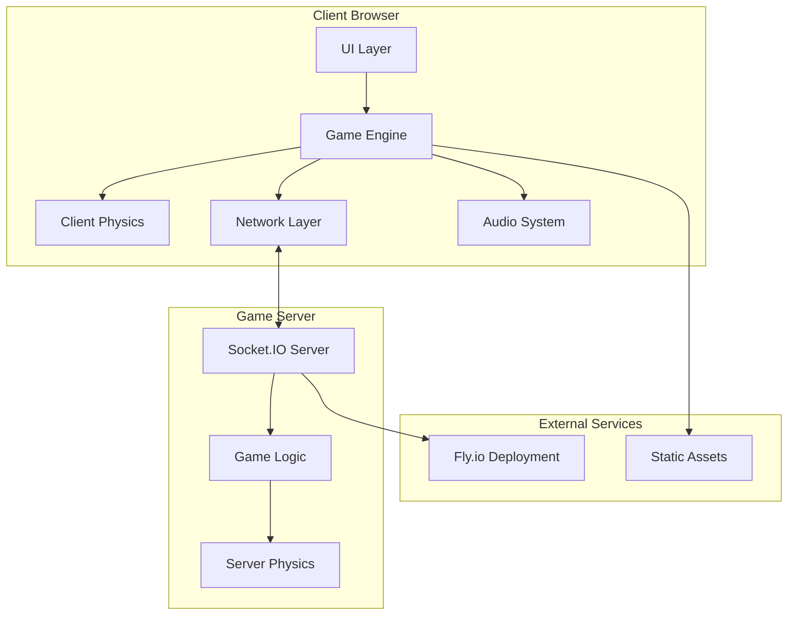
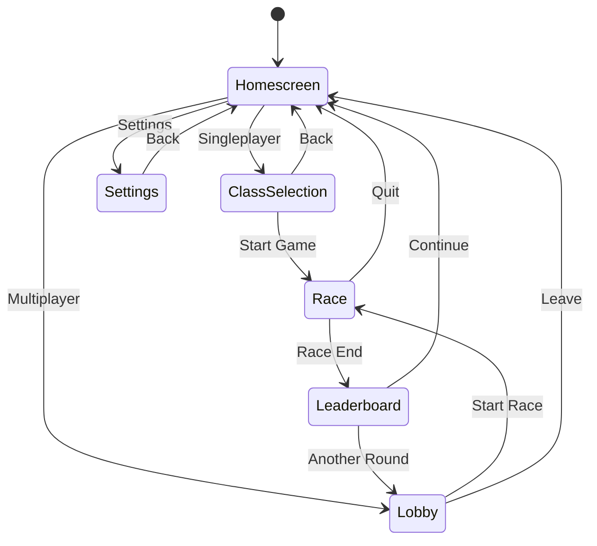

# Wreckless Technical Overview

*A comprehensive guide to the architecture, technology stack, and codebase organization*

---

## 🎯 Project Overview

**Wreckless** is a real-time multiplayer browser game that combines high-speed racing with tactical melee combat. Players choose from three distinct mobility classes and compete on an intersecting figure-8 track, creating natural combat encounters while maintaining clear race progression.

**Core Innovation**: By merging racing and combat on an intersecting track design, we solve the "optimal line problem" of traditional racing games while avoiding the chaos of pure combat games. Strategic encounters happen naturally where paths cross.

---

## 🛠️ Technology Stack

### Frontend Technologies

| Technology | Version | Purpose | Why We Chose It |
|------------|---------|---------|-----------------|
| **Three.js** | r178 | 3D Graphics Engine | Industry standard for web 3D, excellent performance, large ecosystem |
| **TypeScript** | 5.8.3 | Language | Type safety for complex game logic, better IDE support, catches bugs early |
| **Rapier.js** | 0.18.0-beta.0 | Physics Engine | WebAssembly performance, robust collision detection, cross-platform |
| **Vite** | 7.0.4 | Build Tool | Fast development server, excellent TypeScript support, modern bundling |
| **Socket.IO Client** | 4.8.1 | Real-time Communication | Reliable WebSocket fallbacks, event-based architecture |

### Backend Technologies

| Technology | Version | Purpose | Why We Chose It |
|------------|---------|---------|-----------------|
| **Node.js** | 18+ | Server Runtime | JavaScript everywhere, excellent Socket.IO integration |
| **Socket.IO** | 4.8.1 | Real-time Server | Handles connection drops gracefully, room management, broadcasting |
| **Express** | 4.19.2 | Web Framework | Simple, lightweight, perfect for game server needs |
| **Rapier.js** | 0.18.0-beta.0 | Server Physics | Deterministic physics, prevents client-side cheating |

### Infrastructure & Deployment

- **Fly.io**: Production deployment with global edge locations
- **CORS Configuration**: Multi-domain support for development and production
- **Environment Management**: Separate configs for dev/staging/production

---

## 🏗️ Architecture Overview

### High-Level Architecture



### Data Flow Architecture

1. **Client Input** → Local physics simulation (immediate feedback)
2. **Client State** → Server validation via Socket.IO
3. **Server Authority** → Authoritative game state broadcast
4. **Client Reconciliation** → Smooth interpolation of server state

---

## 📁 Codebase Organization

### Frontend Structure (`/client/src/`)

```
client/src/
├── main.ts                 # 🚀 Application entry point
├── controller.ts           # 🎮 Input handling system
├── physics.ts             # ⚡ Rapier.js integration
├── ui.ts                  # 🖥️ Legacy UI management
├── menu.ts                # 🎯 Pause menu system
│
├── audio/                 # 🔊 Audio System
│   └── AudioManager.ts    # Complete audio manager with SFX and music
│
├── combat/                # ⚔️ Combat System
│   ├── MeleeCombat.ts     # Hit detection and damage
│   ├── TargetDummy.ts     # Practice targets with enhanced FX
│   ├── DummyPhysicsManager.ts  # Physics integration
│   ├── DummyPlacementManager.ts # Dummy positioning
│   └── index.ts           # Combat system exports
│
├── config/                # ⚙️ Game Configuration
│   └── combat.ts          # Combat configuration constants
│
├── data/                  # 📊 Data Management
│   ├── DummyLoader.ts     # Dummy data loading
│   ├── dummyPositions.json # Static dummy positions
│   └── DummyPositionTypes.ts # Type definitions
│
├── dev/                   # 🛠️ Development Tools
│   └── DeveloperTools.ts  # Debug utilities and performance monitoring
│
├── effects/               # ✨ Visual Effects System
│   ├── CameraEffectsManager.ts  # Central camera effects framework
│   ├── BlastExplosionRing.ts    # Blast ability ring effect
│   ├── BlastShakeEffect.ts      # Blast-specific camera shake
│   ├── BlinkRingEffect.ts       # Blink ability ring effect
│   ├── BlinkScreenFlash.ts      # Blink teleport flash
│   ├── BlinkZoomEffect.ts       # Blink zoom-out effect
│   ├── BoostShakeEffect.ts      # Speed boost camera shake
│   ├── CheckpointHitEffect.ts   # Checkpoint progression effects
│   ├── GrappleLatchRing.ts      # Grapple latch visual
│   ├── HitShakeEffect.ts        # Combat hit feedback
│   ├── SpeedFovEffect.ts        # Speed-based FOV adjustment
│   └── WindStreakEffect.ts      # High-speed visual overlay
│
├── hud/                   # 📊 User Interface
│   ├── GameHUD.ts         # Main game UI coordinator
│   ├── HealthHUD.ts       # Health display system
│   ├── Hud.ts             # Legacy HUD components
│   ├── HUDToggleSystem.ts # HUD visibility management
│   ├── RoundEndUI.ts      # Race results screen
│   ├── RoundStartUI.ts    # Race countdown system
│   ├── ScoreHUD.ts        # Real-time scoring display
│   └── TestingHelpHUD.ts  # Development help overlay
│
├── kits/                  # 🎭 Character Classes
│   ├── classKit.ts        # Class selection and management
│   ├── blast.ts           # Blast-Jumper abilities
│   ├── blink.ts           # Blink-Dasher abilities
│   ├── grapple.ts         # Grapple-Swinger abilities
│   ├── useAbility.ts      # Unified ability management
│   ├── AbilityHUD.ts      # Ability UI components
│   ├── swingConfig.ts     # Grapple configuration
│   └── [Legacy Files]     # Archived previous implementations
│
├── net/                   # 🌐 Networking Layer
│   ├── Network.ts         # Socket.IO client with auto-detection
│   ├── MultiplayerManager.ts  # Remote player rendering
│   ├── index.ts           # Network module exports
│   └── README.md          # Networking documentation
│
├── player/                # 👤 Character System
│   ├── AutoCharacterLoader.ts     # Modern character system with portraits
│   ├── CharacterAnimationManager.ts # Animation loading framework
│   ├── CharacterSystem.ts         # Legacy character management
│   ├── PlayerCharacterManager.ts  # Character-player integration
│   ├── PlayerHealth.ts            # Health system integration
│   ├── SimpleCharacterTest.ts     # Development character testing
│   └── CHARACTER_ANIMATION_SETUP.md # Setup documentation
│
├── state/                 # 🎮 Game State Management
│   └── GameStateManager.ts # Central state machine for game flow
│
├── systems/               # 🔧 Game Systems
│   ├── CheckpointSystem.ts   # Progress tracking and lap management
│   ├── LapController.ts      # Legacy lap management
│   ├── RaceRoundSystem.ts    # Race state and scoring
│   └── HitVolume.ts          # Collision detection volumes
│
├── track/                 # 🏁 Track System
│   ├── ProceduralTrack.ts     # Procedural track generation
│   ├── ExternalTrack.ts       # External track loader (.glb)
│   └── CollisionClipper.ts    # Track collision optimization
│
├── ui/                    # 🖼️ User Interface Screens
│   ├── HomeScreen.ts          # Main menu screen
│   ├── ClassSelection.ts      # Character class selection
│   ├── LobbyScreen.ts         # Multiplayer lobby
│   └── SettingsScreen.ts      # Audio and game settings
│
├── utils/                 # 🛠️ Utility Functions
│   └── [Various utilities]
│
└── visual/                # 🎨 Visual Systems
    ├── SceneBackdrop.ts       # Environment and skybox
    ├── TrailSystem.ts         # Motion trail effects
    └── BoostOverlay.ts        # Speed boost visual overlay
```

### Backend Structure (`/server/`)

```
server/
├── index.js                 # 🚀 Server entry point
├── ServerGameLogic.js       # 🎮 Authoritative game state
├── physics/
│   └── ServerPhysics.js     # ⚡ Server-side physics simulation
├── debug-server-clean.js    # 🐛 Clean debugging server
├── debug-server.js          # 🐛 Full debug server
├── test-server.js           # 🧪 Physics testing server
├── test-server-simple.js    # 🧪 Minimal test server
└── fly.toml                 # 🚁 Fly.io deployment config
```

---

## 🔧 Key Technical Systems

### 1. Physics Architecture

**Dual Physics System**: Client prediction with server authority
- **Client**: Immediate response for smooth gameplay using Rapier.js
- **Server**: Authoritative validation prevents cheating
- **Reconciliation**: Client smoothly interpolates server corrections

```typescript
// Client-side prediction
const predictedPosition = simulatePhysics(input, deltaTime);
player.position.copy(predictedPosition);

// Server validation
if (serverPosition.distanceTo(predictedPosition) > threshold) {
    smoothInterpolateToServerState();
}
```

### 2. Game State Management

**Centralized State Machine**: `GameStateManager` controls game flow
- **States**: `homescreen` → `class-selection` → `lobby` → `race` → `leaderboard`
- **Context Preservation**: Maintains selected class, game mode, settings
- **Input Management**: Blocks player movement during menus
- **System Integration**: Coordinates with existing round and physics systems

```typescript
// State transitions with validation
gameStateManager.transitionTo('race', { gameMode: 'singleplayer' });

// Context management
gameStateManager.selectClass('blast');
gameStateManager.startSingleplayer();
```

### 3. Audio System

**Comprehensive Audio Management**: `AudioManager` singleton
- **Background Music**: Looping background track with volume controls
- **SFX Categories**: Abilities, movement, UI, environment, combat
- **Speed-Based Audio**: Ambient wind volume scales with player speed
- **Optimized Volumes**: User-tested volume levels for all sound effects
- **Settings Persistence**: Audio preferences saved to localStorage

```typescript
// Audio integration
audioManager.playSFX('abilities', 'blast_launch.wav');
audioManager.updateSpeed(currentSpeed); // For ambient wind scaling
```

### 4. Camera Effects Framework

**Modular Camera Effects**: `CameraEffectsManager` with plugin architecture
- **Speed FOV**: FOV increases from 90° to 105° at high speeds
- **Shake Effects**: Hit shake, blast shake, boost shake with different intensities
- **Zoom Effects**: Blink zoom-out effect during teleportation
- **Wind Streaks**: HTML overlay with shake effects at high speeds
- **Checkpoint Effects**: Screen flash and shake for checkpoint hits

```typescript
// Camera effects usage
CameraEffects.register(new SpeedFovEffect());
CameraEffects.register(new BlinkZoomEffect());
```

### 5. Character Animation System

**Advanced Character Management**: `AutoCharacterLoader` with animation states
- **Animation States**: idle, running, jumping, falling, swing
- **Class Support**: All three character classes with unique animations
- **Portrait System**: 3D character portraits in corner overlay
- **Preloading**: Background animation loading for instant access
- **Movement Integration**: Animations respond to player velocity and state

```typescript
// Character system integration
autoCharacterLoader.loadCharacterForClass('blast');
autoCharacterLoader.update(deltaTime, playerPosition, playerVelocity);
```

### 6. Real-time Networking

**Event-Driven Architecture**: Socket.IO with automatic mode detection
- **URL-Based Activation**: `#online` hash enables multiplayer mode
- **Input Synchronization**: 30Hz input updates to server
- **State Broadcasting**: 60Hz server state updates
- **Graceful Fallbacks**: Offline mode when server unavailable

```javascript
// Key network events
socket.on('player-move', handleMovement);
socket.on('ability-used', handleAbility);
socket.on('combat-hit', handleCombat);
socket.on('lobby-update', handleLobbyState);
```

### 8. Comprehensive Memory Management System

**Production-Grade Resource Management**: Systematic prevention of memory leaks and crashes
- **Animation Frame Tracking**: Global tracking prevents infinite loop buildup
- **Event Listener Management**: Automatic tracking and cleanup on disposal
- **WebGL Context Recovery**: Graceful handling of context loss with fallbacks
- **Resource Lifecycle**: Dispose patterns across all major systems

```typescript
// Memory management pattern implementation
export class SystemClass {
  private isDisposed = false;
  private eventListeners: EventListenerTracker[] = [];
  private animationFrames = new Set<number>();
  
  public dispose(): void {
    if (this.isDisposed) return;
    this.isDisposed = true;
    
    // Cancel all animation frames
    this.animationFrames.forEach(id => cancelAnimationFrame(id));
    
    // Remove all event listeners  
    this.eventListeners.forEach(({target, type, handler}) => {
      target.removeEventListener(type, handler);
    });
    
    // Clear resources
    this.cleanup();
  }
}
```

**Critical Issues Resolved:**
- **Animation Loop Crashes**: Fixed infinite `requestAnimationFrame` buildup
- **Event Listener Leaks**: Comprehensive tracking and cleanup systems
- **WebGL Context Loss**: Recovery mechanisms prevent renderer corruption
- **Race Conditions**: Mode switching locks prevent concurrent operations
- **Use After Disposal**: Disposal flags prevent operations on destroyed objects

### 9. Visual Effects Pipeline

**Comprehensive Visual Feedback**: Multiple effect systems
- **Ring Effects**: Blast explosions, blink arrivals, grapple latches
- **Screen Effects**: Flash overlays, zoom effects, shake systems
- **Motion Effects**: Trail system, wind streaks, boost overlays
- **HUD Effects**: Health bars, ability cooldowns, score displays

---

## 🎮 Game Flow & State Management

### Enhanced State Machine



### State Synchronization

1. **Menu States**: UI visibility, input blocking, context preservation
2. **Race State**: Positions, health, abilities, checkpoints, scoring
3. **Audio State**: Settings persistence, speed-based ambient audio
4. **Animation State**: Character loading, animation synchronization

---

## 🚀 Performance Considerations

### Rendering Optimizations

- **Low-Poly Assets**: < 50k triangles total budget maintained
- **Texture Optimization**: 256px resolution for mobile compatibility
- **Animation Efficiency**: Smart animation state management
- **Effect Budgets**: Controlled particle counts and update frequencies
- **Character LOD**: Portrait rendering separate from main scene

### Audio Optimizations

- **SFX Caching**: Reuse audio objects for frequently played sounds
- **Volume Optimization**: User-tested optimal volume levels
- **Streaming**: Background music with efficient loading
- **Speed-Based Scaling**: Dynamic ambient audio based on movement

### Memory Management

- **Effect Cleanup**: Proper disposal of visual effects and timeouts
- **Audio Cleanup**: Cache management for sound effects
- **Animation Cleanup**: Mixer disposal and memory leak prevention
- **Character Management**: Efficient switching between character models

### Network Optimizations

- **Smart Activation**: Networking only enabled with `#online` URL
- **Efficient Updates**: 30Hz input, 60Hz state synchronization
- **Graceful Degradation**: Offline fallback when server unavailable
- **State Compression**: Only send changed data

---

## 🎯 Unique Technical Achievements

### Achievement 1: Critical Animation Loop Bug Resolution
**Innovation**: Identified and resolved infinite animation loop crash that caused "recursive use of object detected" errors
**Technical Details**:
- **Root Cause**: AbilityManager creating uncancelled `requestAnimationFrame` loops
- **Solution**: Comprehensive cleanup system with disposal patterns and emergency recovery
- **Impact**: Eliminated production-blocking crashes when hitting dummies or during extended gameplay

**Implementation**:
- Added `dispose()` methods with animation frame tracking
- Emergency cleanup on WebGL context loss
- Race condition prevention during mode switching
- Resource lifecycle management across all systems

### Achievement 2: Comprehensive Memory Leak Prevention
**Innovation**: Systematic identification and prevention of 15 critical memory leak patterns
**Benefit**: 
- Event listener leak prevention with tracking and cleanup
- Animation frame buildup prevention with global limits
- WebGL context loss recovery with graceful fallbacks
- Safe disposal patterns preventing use-after-destruction

**Technical Implementation**:
- Resource tracking systems for animation frames and event listeners
- Disposal flags preventing operations after cleanup
- WebGL context validation before rendering operations
- Emergency cleanup mechanisms for system stress conditions

### Achievement 3: Advanced 3-Portrait System
**Innovation**: Three-mode character portrait system (None/TF2-Style/3D) with safe mode switching
**Benefit**:
- Scene isolation preventing 3D portraits from affecting main game
- TF2-style static portraits with optimized asset loading
- Graceful fallback mechanisms for WebGL failures
- Memory-safe portrait mode switching without crashes

### Achievement 4: Modular Camera Effects
**Innovation**: Plugin-based camera effects system
**Benefit**: 
- Easy to add new effects without modifying core camera code
- Each effect is self-contained and can be enabled/disabled independently
- Smooth integration with existing visual feedback systems

### Achievement 5: Speed-Responsive Audio
**Innovation**: Dynamic ambient audio that scales with player movement speed
**Benefit**:
- Enhanced sense of speed and momentum
- Natural audio feedback for gameplay actions
- Optimized volume levels through user testing
- Music attribution display in settings UI

### Achievement 6: Seamless State Management
**Innovation**: Centralized game state machine with context preservation
**Benefit**:
- Clean transitions between menu and gameplay states
- Proper input blocking during menus
- Integration with existing systems without breaking them

### Achievement 7: Intelligent Character System
**Innovation**: Auto-loading character animations with portrait preview
**Benefit**:
- Instant character switching without loading delays
- 3D character portraits for class selection
- Animation state management tied to actual player movement

### Achievement 8: Asset Attribution & Legal Compliance System
**Innovation**: Comprehensive asset tracking with automated legal compliance documentation
**Benefit**:
- Complete attribution documentation for all game assets
- Legal compliance preparation for production release
- Automated asset tracking across codebase
- Ready-to-use attribution display in game UI

---

## 🔍 Development Workflow

### Local Development Modes

1. **Offline Mode** (Default): `npm run dev`
   - Client-only development
   - All features work locally
   - No networking overhead

2. **Online Mode**: `npm run dev:online`
   - Full multiplayer testing
   - Client + server with auto-restart
   - Real-time networking validation

### Code Quality & Architecture

- **TypeScript Strict Mode**: Enhanced type safety for complex systems
- **Modular Design**: Each system is self-contained and testable
- **Event-Driven Architecture**: Loose coupling between systems
- **Performance Monitoring**: Built-in FPS tracking and memory monitoring
- **Three.js Best Practices**: Following established patterns for 3D development

### Testing & Debugging

- **Auto Character System**: `__autoChar` debug commands for testing
- **Network Debugging**: `window.debugNetwork()` for connection status
- **Audio Testing**: Volume optimization and SFX validation
- **State Management**: Clean state transitions and context validation

---

## 📊 Current Metrics & Performance

### Performance Targets (Achieved)
- **Frame Rate**: 60fps on Intel integrated graphics ✅
- **Physics Budget**: ≤ 2ms per frame ✅
- **Memory Usage**: < 512MB total ✅
- **Audio Latency**: < 50ms SFX response ✅
- **Network Latency**: < 100ms optimal ✅
- **System Stability**: Production-stable (critical crash bugs resolved) ✅
- **Memory Management**: Comprehensive leak prevention implemented ✅

### Feature Completeness
- **Core Gameplay**: 100% - Racing, combat, abilities ✅
- **Audio System**: 100% - Music, SFX, ambient audio, attribution ✅
- **Visual Effects**: 95% - All major effects implemented ✅
- **Character System**: 95% - 3-portrait system, animation management ✅
- **System Stability**: 100% - Memory leaks fixed, crash prevention ✅
- **Multiplayer**: 85% - Networking functional, needs polish
- **UI/UX**: 95% - Complete menu flow, asset attribution ✅
- **Legal Compliance**: 90% - Asset attribution system ready ✅

---

## 🚀 Future Technical Roadmap

### Short Term (Next Sprint)
- **Complete Character Animations**: FBX animations for Blast and Blink classes (currently only Grapple has full animations)
- **Audio Asset Integration**: Add missing SFX files identified in SFX_REQUIREMENTS.md
- **Loading Screen**: Implement proper loading feedback during asset initialization
- **Mobile Optimization**: Touch controls and performance tuning
- **Production Deployment**: Finalize Fly.io deployment with asset optimization

### Medium Term
- **New Maps**: Additional track designs beyond the current figure-8 layout
- **Enhanced Combat System**: Implement full PvP combat mechanics alongside dummy system
- **Multiple Lobbies**: Support for more than one concurrent game lobby
- **Tutorial System**: Record and integrate interactive tutorials for new players
- **Lore Page**: Add backstory and world-building content to enhance game immersion
- **Advanced Networking**: WebRTC for lower latency peer-to-peer
- **Enhanced Effects**: Particle systems and advanced shaders
- **Spectator Mode**: Watch other players with camera controls
- **Replay System**: Record and playback race sessions

### Long Term
- **Procedural Content**: Dynamic track generation system
- **Machine Learning**: Adaptive difficulty and balance tuning
- **Cross-Platform**: Native mobile app development
- **VR Support**: Immersive racing experience
- **Ranked Competitive**: Skill-based matchmaking and seasonal rankings
- **Custom Map Editor**: Player-created tracks with sharing system

---

## 🤝 Contributing Guidelines

### Architecture Principles
1. **Modularity**: Each system should be self-contained and testable
2. **Performance First**: Always consider 60fps target in design decisions
3. **Event-Driven**: Use events for loose coupling between systems
4. **Type Safety**: Leverage TypeScript for reliability and maintainability

### Code Review Focus Areas
- **Performance Impact**: Will this affect the 60fps target?
- **Memory Management**: Are resources properly cleaned up?
- **State Management**: Does this integrate cleanly with GameStateManager?
- **Audio Integration**: Are sound effects properly categorized and optimized?
- **Visual Consistency**: Do effects follow the established visual language?

### Getting Started
1. **Setup**: Follow DEV_WORKFLOW.md for environment setup
2. **Architecture**: Read this document and Three.js best practices
3. **Testing**: Use both offline and online modes for validation
4. **Integration**: Test with existing systems before submitting PRs

---

*This technical overview reflects the current state of Wreckless as a sophisticated browser-based racing game with advanced audio, visual effects, character systems, and multiplayer capabilities. The architecture supports rapid development while maintaining high performance and code quality standards.* 