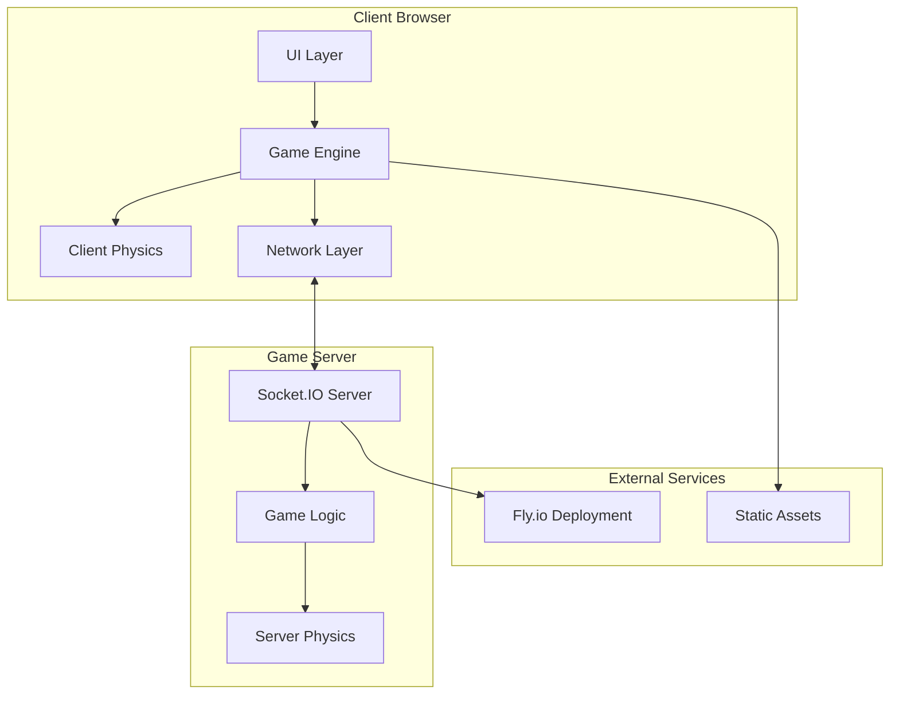
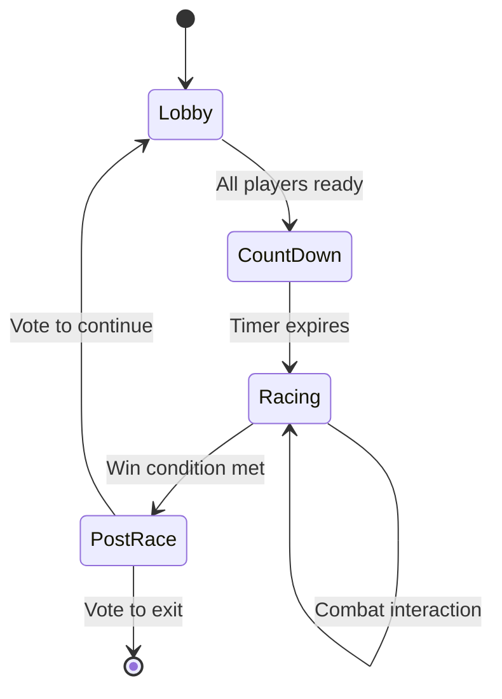

# Wreckless Technical Overview

*A comprehensive guide to the architecture, technology stack, and codebase organization*

---

## 🎯 Project Overview

**Wreckless** is a real-time multiplayer browser game that combines high-speed racing with tactical melee combat. Players choose from three distinct mobility classes and compete on an intersecting figure-8 track, creating natural combat encounters while maintaining clear race progression.

**Core Innovation**: By merging racing and combat on an intersecting track design, we solve the "optimal line problem" of traditional racing games while avoiding the chaos of pure combat games. Strategic encounters happen naturally where paths cross.

---

## 🛠️ Technology Stack

### Frontend Technologies

| Technology | Version | Purpose | Why We Chose It |
|------------|---------|---------|-----------------|
| **Three.js** | r178 | 3D Graphics Engine | Industry standard for web 3D, excellent performance, large ecosystem |
| **TypeScript** | 5.8.3 | Language | Type safety for complex game logic, better IDE support, catches bugs early |
| **Rapier.js** | 0.18.0-beta | Physics Engine | WebAssembly performance, robust collision detection, cross-platform |
| **Vite** | 7.0.4 | Build Tool | Fast development server, excellent TypeScript support, modern bundling |
| **Socket.IO Client** | 4.8.1 | Real-time Communication | Reliable WebSocket fallbacks, event-based architecture |

### Backend Technologies

| Technology | Version | Purpose | Why We Chose It |
|------------|---------|---------|-----------------|
| **Node.js** | 18+ | Server Runtime | JavaScript everywhere, excellent Socket.IO integration |
| **Socket.IO** | 4.8.1 | Real-time Server | Handles connection drops gracefully, room management, broadcasting |
| **Express** | 4.19.2 | Web Framework | Simple, lightweight, perfect for game server needs |
| **Rapier.js** | 0.18.0-beta | Server Physics | Deterministic physics, prevents client-side cheating |

### Infrastructure & Deployment

- **Fly.io**: Production deployment with global edge locations
- **CORS Configuration**: Multi-domain support for development and production
- **Environment Management**: Separate configs for dev/staging/production

---

## 🏗️ Architecture Overview

### High-Level Architecture



### Data Flow Architecture

1. **Client Input** → Local physics simulation (immediate feedback)
2. **Client State** → Server validation via Socket.IO
3. **Server Authority** → Authoritative game state broadcast
4. **Client Reconciliation** → Smooth interpolation of server state

---

## 📁 Codebase Organization

### Frontend Structure (`/client/src/`)

```
client/src/
├── main.ts                 # 🚀 Application entry point
├── controller.ts           # 🎮 Input handling system
├── physics.ts             # ⚡ Rapier.js integration
├── ui.ts                  # 🖥️ UI management
│
├── combat/                # ⚔️ Combat System
│   ├── MeleeCombat.ts     # Hit detection and damage
│   ├── TargetDummy.ts     # Practice targets
│   └── DummyPlacementManager.ts
│
├── kits/                  # 🎭 Character Classes
│   ├── classKit.ts        # Class selection system
│   ├── blast.ts          # Blast-Jumper abilities
│   ├── blink.ts          # Blink-Dasher abilities
│   ├── grapple.ts        # Grapple-Swinger abilities
│   ├── useAbility.ts     # Ability management
│   └── AbilityHUD.ts     # Ability UI components
│
├── systems/               # 🔧 Game Systems
│   ├── CheckpointSystem.ts   # Progress tracking
│   ├── LapController.ts      # Lap management
│   ├── RaceRoundSystem.ts    # Race state management
│   └── HitVolume.ts          # Collision volumes
│
├── hud/                   # 📊 User Interface
│   ├── GameHUD.ts         # Main game UI
│   ├── HealthHUD.ts       # Health display
│   ├── ScoreHUD.ts        # Leaderboard
│   ├── RoundStartUI.ts    # Race countdown
│   └── RoundEndUI.ts      # Results screen
│
├── effects/               # ✨ Visual Effects
│   ├── CameraEffectsManager.ts  # Camera shake/zoom
│   ├── WindStreakEffect.ts      # Speed effects
│   ├── BlinkZoomEffect.ts       # Teleport visuals
│   └── [Other Effects]
│
├── player/                # 👤 Character System
│   ├── CharacterSystem.ts       # Character management
│   ├── PlayerHealth.ts          # Health system
│   └── AutoCharacterLoader.ts   # 3D model loading
│
├── net/                   # 🌐 Networking
│   ├── Network.ts             # Socket.IO client
│   ├── MultiplayerManager.ts  # Game state sync
│   └── index.ts               # Network initialization
│
├── track/                 # 🏁 Track System
│   ├── ProceduralTrack.ts     # Track generation
│   ├── ExternalTrack.ts       # External track loader
│   └── CollisionClipper.ts    # Track collision
│
└── visual/                # 🎨 Visual Systems
    ├── SceneBackdrop.ts       # Environment
    ├── TrailSystem.ts         # Motion trails
    └── BoostOverlay.ts        # Speed effects
```

### Backend Structure (`/server/`)

```
server/
├── index.js                 # 🚀 Server entry point
├── ServerGameLogic.js       # 🎮 Game state management
├── physics/
│   └── ServerPhysics.js     # ⚡ Authoritative physics
└── [Debug Scripts]          # 🐛 Development tools
```

---

## 🔧 Key Technical Systems

### 1. Physics Architecture

**Dual Physics System**: Client prediction with server authority
- **Client**: Immediate response for smooth gameplay
- **Server**: Authoritative validation prevents cheating
- **Reconciliation**: Client smoothly interpolates server corrections

```typescript
// Client-side prediction
const predictedPosition = simulatePhysics(input, deltaTime);
player.position.copy(predictedPosition);

// Server validation
if (serverPosition.distanceTo(predictedPosition) > threshold) {
    smoothInterpolateToServerState();
}
```

### 2. Character Class System

**Ability Framework**: Unified system for different class abilities
- **Cooldown Management**: Visual feedback and state tracking
- **Effect Systems**: Consistent visual and audio feedback
- **Balance Integration**: Configurable parameters for easy tuning

### 3. Real-time Networking

**Event-Driven Architecture**: Socket.IO events for different game actions
```javascript
// Key network events
socket.on('player-move', handleMovement);
socket.on('ability-used', handleAbility);
socket.on('combat-hit', handleCombat);
socket.on('checkpoint-hit', handleProgress);
```

### 4. Performance Optimization

**Frame Budget System**: Each system has a maximum time allocation
- **Physics**: ≤ 2ms per frame
- **Rendering**: Optimized for 60fps on low-end devices
- **Memory**: Efficient object pooling and disposal

---

## 🎮 Game Flow & State Management

### Race State Machine



### State Synchronization

1. **Lobby State**: Player connections, class selection
2. **Race State**: Positions, health, abilities, checkpoints
3. **Post-Race State**: Results, voting system

---

## 🚀 Performance Considerations

### Rendering Optimizations

- **Low-Poly Assets**: < 50k triangles total budget
- **Texture Optimization**: 256px resolution for mobile compatibility
- **LOD System**: Distance-based detail reduction
- **Frustum Culling**: Only render visible objects

### Network Optimizations

- **Tick Rate**: 60Hz for smooth multiplayer
- **Bandwidth**: < 50KB/s per client
- **State Compression**: Only send changed data
- **Lag Compensation**: Client-side prediction

### Memory Management

- **Object Pooling**: Reuse Three.js objects
- **Garbage Collection**: Minimize allocations in render loop
- **Asset Disposal**: Proper cleanup of textures and geometries

---

## 🎯 Unique Technical Challenges & Solutions

### Challenge 1: Combat Hit Detection
**Problem**: Reliable hit detection between fast-moving players
**Solution**: 
- Server-side raycasting with interpolation
- Client prediction for immediate feedback
- Reconciliation for accuracy

### Challenge 2: Ability Balance
**Problem**: Each class needs distinct feel while maintaining fairness
**Solution**:
- Configurable ability parameters
- Trade-off system (power vs. recovery time)
- Extensive playtesting data collection

### Challenge 3: Cross-Platform Performance
**Problem**: Smooth gameplay on varying device capabilities
**Solution**:
- Dynamic quality scaling
- Strict performance budgets
- Progressive enhancement approach

---

## 🔍 Development Workflow

### Local Development

1. **Server**: `npm run dev` (auto-reloading Node.js)
2. **Client**: `npm run dev` (Vite hot module replacement)
3. **Testing**: Built-in multiplayer testing tools

### Code Quality

- **TypeScript**: Strict type checking
- **Three.js Best Practices**: Following established patterns
- **Performance Monitoring**: Built-in FPS and memory tracking
- **Networking Debug**: Real-time latency and packet visualization

### Deployment Pipeline

1. **Build**: TypeScript compilation and bundling
2. **Test**: Automated multiplayer testing
3. **Deploy**: Fly.io with zero-downtime deployment

---

## 📊 Metrics & Monitoring

### Performance Metrics
- Target: 60fps on Intel integrated graphics
- Physics budget: ≤ 2ms per frame
- Memory usage: < 512MB total
- Network latency: < 100ms optimal

### Game Metrics
- Match completion rates
- Class balance statistics
- Player retention data
- Performance across different devices

---

## 🚀 Future Technical Improvements

### Short Term
- Mobile touch controls optimization
- Audio system implementation
- Improved visual effects pipeline
- Enhanced spectator mode

### Long Term
- WebRTC peer-to-peer for lower latency
- Advanced physics-based destruction
- Procedural track generation
- Machine learning for dynamic balancing

---

## 🤝 Contributing to the Codebase

### Getting Started
1. Read the Three.js best practices in the project rules
2. Follow TypeScript strict mode requirements
3. Maintain 60fps performance target
4. Test multiplayer functionality locally

### Architecture Guidelines
- **Single Responsibility**: Each system handles one concern
- **Event-Driven**: Use events for loose coupling
- **Performance First**: Always consider frame budget
- **Type Safety**: Leverage TypeScript for reliability

### Code Review Focus Areas
- Performance impact assessment
- Multiplayer state synchronization
- Visual effect optimization
- Input responsiveness

---

*This technical overview provides the foundation for understanding Wreckless's architecture and contributing effectively to the codebase. For specific implementation details, refer to the inline documentation and system-specific README files.* 